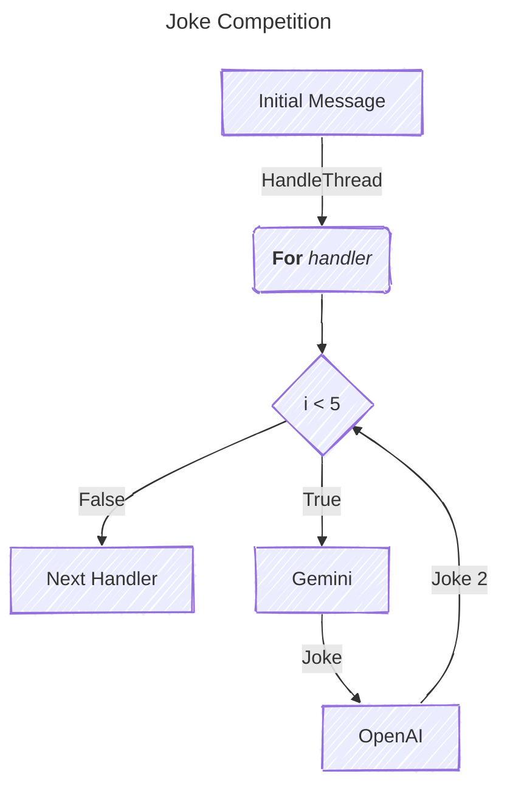
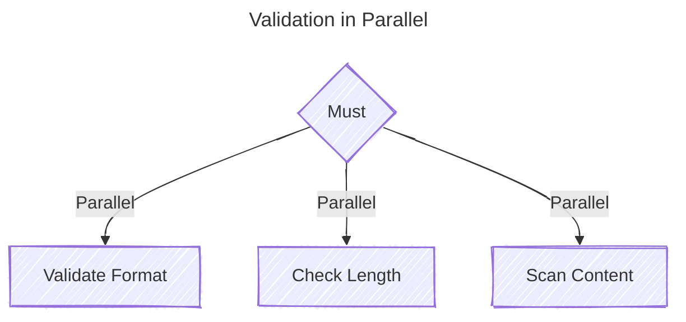
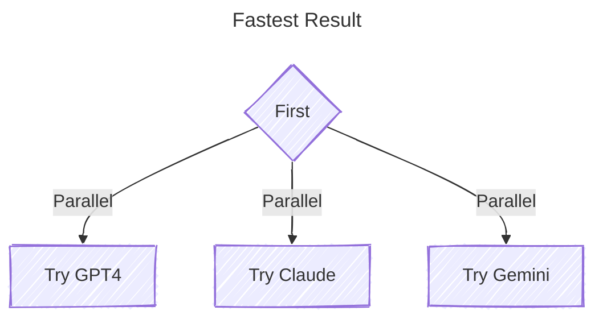
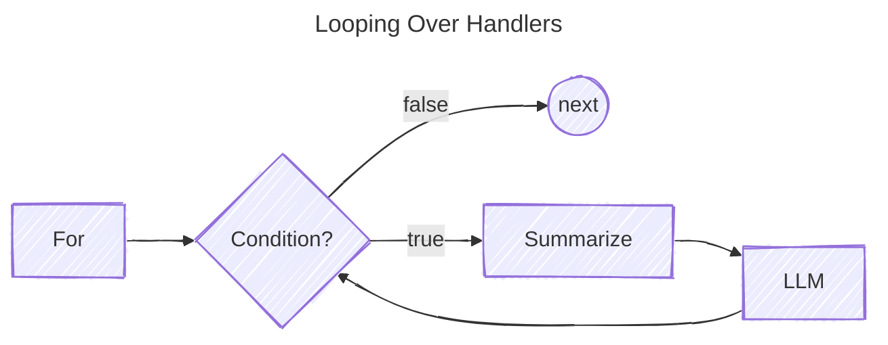

# Minds Toolkit

A lightweight Go library for building LLM-based applications through the
composition of handlers, inspired by the `http.Handler` middleware pattern.

This toolkit takes inspiration from LangChain's runnables and addresses the need
for a modular, extensible framework for conversational AI development in Go. By
leveraging Go's idiomatic patterns, the library provides a composable middleware
design tailored to processing message threads.

The framework applies the same handler-based design to both LLMs and tool
integrations. It includes implementations for OpenAI and Google's Gemini, as
well as a suite of tools in the `minds/openai`, `minds/gemini`, and
`minds/tools` modules.

## Features

- **Composable Middleware**: Build complex pipelines for handling message threads with composable, reusable handlers.
- **Extensible Design**: Add custom handlers and integrate external APIs with ease.
- **Integration Tools**: Built-in support for LLM providers and tools for generative AI workflows.
- **Testing-Friendly**: Well-structured interfaces and unit-tested components for robust development.

## Installation

```bash
go get github.com/chriscow/minds
```

The Minds Toolkit is designed to minimize dependencies in your project. You can
selectively include only the providers you need. For example, if you need the
OpenAI or Gemini providers, you can install them separately:

```bash
go get github.com/chriscow/minds/openai
go get github.com/chriscow/minds/gemini
```

Similarly, tools are available as separate modules:

```bash
go get github.com/chriscow/minds/tools
```

Since the examples have many dependencies, you should:

```bash
cd _examples
go mod tidy
go run ./chat-completion-provider/
```

## Usage

### Basic Example

Here’s how you can compose handlers for processing a thread. This demonstrates a Joke Competition where two LLMs battle it out telling jokes to each other. We use the `For` handler to limit the number of rounds to 5.  See the `_examples/middleware-ratelimit` example for the full code.




```go
func main() {
	ctx := context.Background()
	geminiJoker, _ := gemini.NewProvider(ctx)
	openAIJoker, _ := openai.NewProvider()

	// Create a rate limiter that allows 1 request every 5 seconds
	limiter := NewRateLimiter("rate_limiter", 1, 5*time.Second)

	printJoke := minds.ThreadHandlerFunc(func(tc minds.ThreadContext, next minds.ThreadHandler) (minds.ThreadContext, error) {
		fmt.Printf("Joke: %s\n", tc.Messages().Last().Content)
		return tc, nil
	})

	// Create a cycle that alternates between both LLMs, each followed by printing the joke
	jokeExchange := handlers.For("joke_exchange", 5,
		geminiJoker,
		printJoke,
		openAIJoker,
		printJoke,
	)
	jokeExchange.Use(limiter)

	// Initial prompt
	prompt := "Tell me a clean, family-friendly joke. Keep it clean and make me laugh!"
	initialThread := minds.NewThreadContext(ctx).WithMessages(minds.Messages{
		{Role: minds.RoleUser, Content: prompt},
	})

	// Let them exchange jokes until context is canceled
	if _, err := jokeExchange.HandleThread(initialThread, nil); err != nil {
		log.Fatalf("Error in joke exchange: %v", err)
	}
}
```

### Adding a Calculator Tool

The library supports Lua and Starlark as tools for LLMs to perform mathematical operations. Here's how to integrate a calculator:

```go
func main() {
	calc, _ := calculator.NewCalculator(calculator.Starlark)
	req := minds.Request{
		Messages: minds.Messages{{Role: minds.RoleUser, Content: "calculate 3+7*4"}},
	}

	llm, _ := openai.NewProvider(openai.WithTool(calc))
	resp, _ := llm.GenerateContent(ctx, req)
	print(resp.Text())
}
```

## Documentation

Refer to the `_examples` provided for guidance on how to use the modules.

## Handler Examples

The Minds toolkit uses composable handlers that implement the `ThreadHandler` interface:

```go
type ThreadHandler interface {
    HandleThread(ThreadContext, ThreadHandler) (ThreadContext, error) 
}
```

Handlers can include middleware through the `Use()` method, allowing for cross-cutting concerns like logging, rate limiting, or validation:

```go
limiter := NewRateLimiter(1, 5*time.Second)
handler := Sequential("example",
    validateHandler,
    llmHandler,
)
handler.Use(limiter) // Apply rate limiting to all handlers in sequence
```

The core handler types include:

- **Sequential**: Runs a set of handlers in order
- **For**: Repeats a handler chain for a specified number of iterations
- **Must**: Runs multiple handlers in parallel, requiring all to succeed
- **First**: Executes handlers in parallel, using the first successful result
- **Range**: Processes a sequence of values through a handler chain
- **Policy**: Uses LLM to validate thread content against policies

The following examples demonstrate some common handler composition patterns...

### Parallel Validation 
All handlers will be executed in parallel and must all succeed otherwise an error is returned.
```go
validate := handlers.Must("validation",
    handlers.NewFormatValidator(),      // you provide these handlers
    handlers.NewLengthValidator(1000),  // ...
    handlers.NewContentScanner(),       // ...
)
```




### Fallback Processing

All handlers executed in parallel. First handler to succceed cancels all others.

```go
gpt4 := openai.NewProvider()
claude := anthropic.NewProvider()
gemini := gemini.NewProvider()

// first successfull response cancels others
first := handlers.First("generate", gpt4, claude, gemini)
```




### Iterative Processing

Use the `For` handler to iterate over handlers N-times or infinately. Provide a conditional function to break early.

```go
llm, _ := openai.NewProvider()
const iterations = 3
process := handlers.For("process", iterations, 
    handlers.Summarize(llm, "Be concise"),
    llm,
)
```



### Conditional Processing

Use the `Switch` handler to route messages based on conditions. This example shows how to handle different types of user requests using metadata and LLM-based routing:

```go
func main() {
    llm, _ := openai.NewProvider()
    
    // Create specialized handlers for different tasks
    calculator := tools.NewCalculator()
    questionHandler := handlers.NewQuestionHandler(llm)
    summaryHandler := handlers.NewSummaryHandler(llm)
    
    // Define conditions and their handlers
    intentSwitch := handlers.Switch("intent-router",
        handlers.NewDefaultHandler(llm), // fallback handler
        handlers.SwitchCase{
            // Use LLM to check if message is a math question
            Condition: handlers.LLMCondition{
                Generator: llm,
                Prompt:   "Does this message contain a mathematical calculation?",
            },
            Handler: calculator,
        },
        handlers.SwitchCase{
            // Check metadata for specific routing
            Condition: handlers.MetadataEquals{
                Key:   "type",
                Value: "question",
            },
            Handler: questionHandler,
        },
        handlers.SwitchCase{
            // Use Lua for complex condition
            Condition: extensions.LuaCondition{
                Script: `
                    -- Check if message is long and needs summarization
                    return string.len(last_message) > 500
                `,
            },
            Handler: summaryHandler,
        },
    )

    // Initial thread with metadata
    thread := minds.NewThreadContext(context.Background()).
        WithMessages(minds.Messages{
            {Role: minds.RoleUser, Content: "What is 7 * 12 + 5?"},
        }).
        WithMetadata(map[string]interface{}{
            "type": "calculation",
        })

    // Process the thread
    result, err := intentSwitch.HandleThread(thread, nil)
    if err != nil {
        log.Fatalf("Error processing thread: %v", err)
    }
    
    fmt.Println("Response:", result.Messages().Last().Content)
}
```


### Batch Processing

Execute a handler for every value in a slice of values. Each valud is placed in metadata for access.

```go 
values := []string{"value1", "value2", "value3"}
process := handlers.Range("batch", processor, values)
```


## Contributing

Contributions are welcome! Please see the [CONTRIBUTING.md](CONTRIBUTING.md) for guidelines.

## License

This project is licensed under the Apache 2.0 License. See the [LICENSE](LICENSE) file for details.

## Acknowledgements

This project is inspired by the `http.Handler` middleware pattern and the need for modular and extensible LLM application development in Go.

