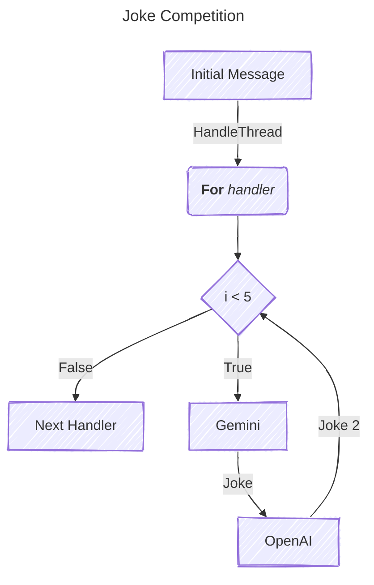
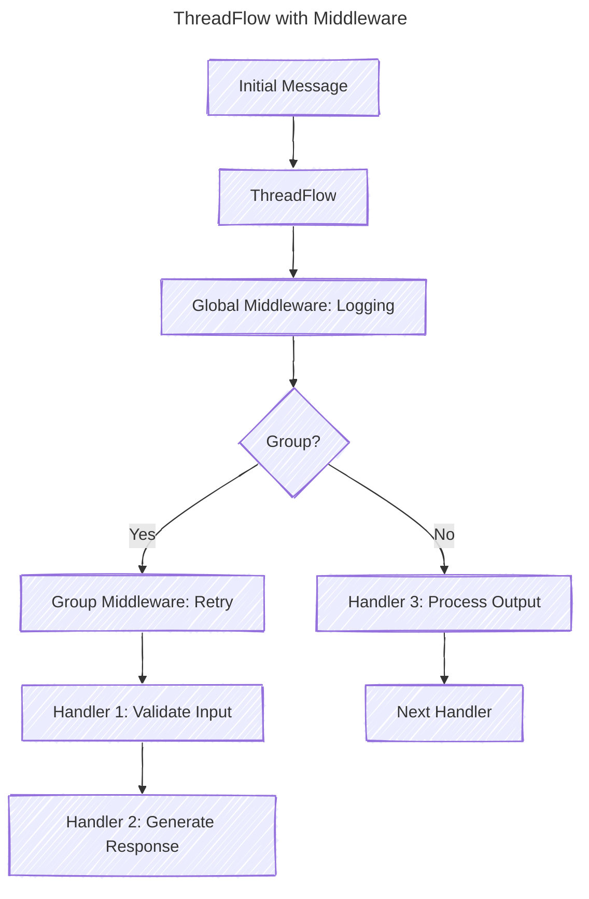
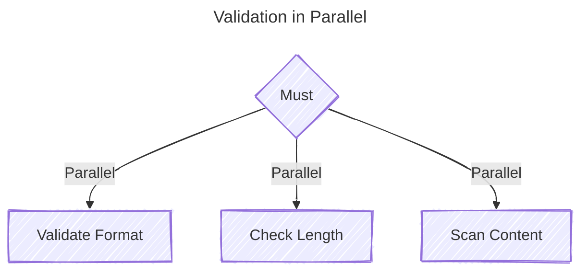
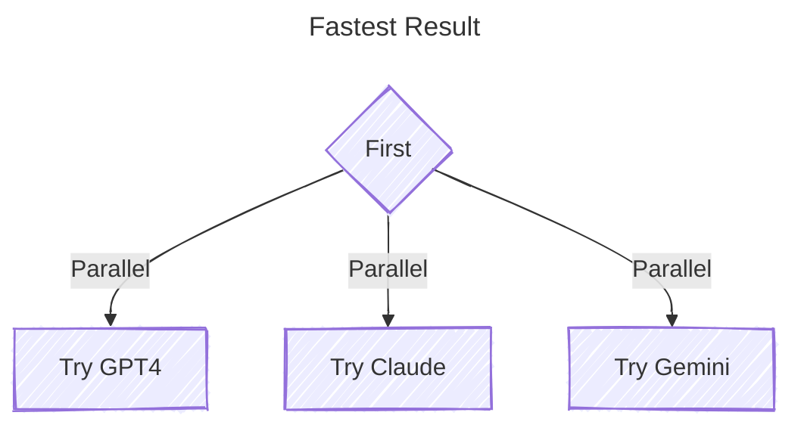
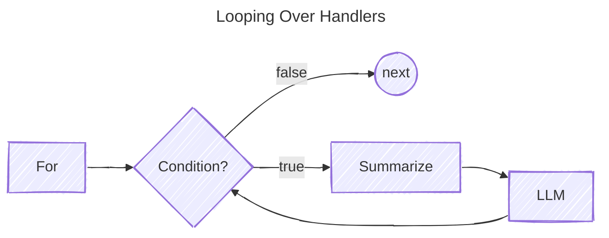

# Minds Toolkit

A lightweight Go library for building LLM-based applications through composable handlers, inspired by the `http.Handler` middleware pattern.

Minds Toolkit provides a modular and extensible framework for conversational AI development in Go. It leverages Go's idiomatic patterns to create a composable middleware design tailored for processing message threads. The framework supports both LLMs and tool integrations, with built-in implementations for OpenAI, Google's Gemini, and a suite of tools in the `minds/openai`, `minds/gemini`, and `minds/tools` modules.

---

## Features

- **Composable Middleware**: Build complex pipelines for handling message threads with reusable handlers.
- **Extensible Design**: Easily add custom handlers and integrate external APIs.
- **Integration Tools**: Built-in support for LLM providers and tools for generative AI workflows.
- **Testing-Friendly**: Well-structured interfaces and unit-tested components for robust development.

---

## Installation

```bash
go get github.com/chriscow/minds
```

The Minds Toolkit is designed to minimize dependencies. You can selectively include only the providers you need:

```bash
go get github.com/chriscow/minds/openai
go get github.com/chriscow/minds/gemini
```

For tools, install the `minds/tools` module:

```bash
go get github.com/chriscow/minds/tools
```

To run examples:

```bash
cd _examples
go mod tidy
go run ./chat-completion-provider/
```

---

## Usage

### Basic Example: Joke Competition

This example demonstrates a Joke Competition where two LLMs exchange jokes. The `For` handler limits the interaction to 5 rounds. See the `_examples/middleware-ratelimit` example for the full code.



```go
func main() {
	ctx := context.Background()
	geminiJoker, _ := gemini.NewProvider(ctx)
	openAIJoker, _ := openai.NewProvider()

	// Rate limiter: 1 request every 5 seconds
	limiter := NewRateLimiter("rate_limiter", 1, 5*time.Second)

	printJoke := minds.ThreadHandlerFunc(func(tc minds.ThreadContext, next minds.ThreadHandler) (minds.ThreadContext, error) {
		fmt.Printf("Joke: %s\n", tc.Messages().Last().Content)
		return tc, nil
	})

	// Create a "For" loop alternating between Gemini and OpenAI
	jokeExchange := handlers.For("joke_exchange", 5,
		geminiJoker,
		printJoke,
		openAIJoker,
		printJoke,
	)

    	flow := handlers.ThreadFlow("joke_competition")
	flow.Use(limiter)
    	flow.Handle(jokeExchange)

	// Initial prompt
	prompt := "Tell me a clean, family-friendly joke. Keep it clean and make me laugh!"
	initialThread := minds.NewThreadContext(ctx).WithMessages(minds.Messages{
		{Role: minds.RoleUser, Content: prompt},
	})

	// Run the joke exchange
	if _, err := flow.HandleThread(initialThread, nil); err != nil {
		log.Fatalf("Error in joke exchange: %v", err)
	}
}
```

---

### Adding a Calculator Tool

The library supports Lua and Starlark for mathematical operations. Here's how to integrate a calculator:

```go
func main() {
	calc, _ := calculator.NewCalculator(calculator.Starlark)
	req := minds.Request{
		Messages: minds.Messages{{Role: minds.RoleUser, Content: "calculate 3+7*4"}},
	}

	llm, _ := openai.NewProvider(openai.WithTool(calc))
	resp, _ := llm.GenerateContent(ctx, req)
	print(resp.Text())
}
```

---

### ThreadFlow: Managing Middleware and Handlers

The **ThreadFlow** handler acts as a top-level component for managing middleware and handlers. It allows you to:
- Add global middleware that applies to all handlers.
- Group handlers and apply middleware specific to that group.

This is particularly useful for organizing complex conversation processing pipelines, where different stages may require different middleware (e.g., logging, retries, timeouts).

---

#### Example: ThreadFlow with Middleware



```go
func main() {
	flow := handlers.NewThreadFlow("conversation")
	flow.Use(Logging("audit")) // Global middleware

	// Base handler for input validation
	flow.Handle(validateInput)

	// Group with specific middleware
	flow.Group(func(f *ThreadFlow) {
		f.Use(Retry("retry", 3))    // Retry up to 3 times
		f.Use(Timeout("timeout", 5)) // Timeout after 5 seconds
		f.Handle(generateResponse)      // Handler for LLM response
		f.Handle(validateOutput)        // Handler for output validation
	})

	// Initial thread
	initialThread := minds.NewThreadContext(context.Background()).WithMessages(minds.Messages{
		{Role: minds.RoleUser, Content: "Hello, world!"},
	})

	// Process the thread
	result, err := flow.HandleThread(initialThread, nil)
	if err != nil {
		log.Fatalf("Error in flow: %v", err)
	}
	fmt.Println("Result:", result.Messages().Last().Content)
}
```

---

#### Key Features of ThreadFlow

1. **Global Middleware**: Middleware added with `Use()` applies to all handlers in the flow.
   ```go
   flow.Use(Logging("audit"))
   ```

2. **Grouped Middleware**: Middleware added within a `Group()` applies only to handlers in that group.
   ```go
   flow.Group(func(f *ThreadFlow) {
       f.Use(middleware.Retry("retry", 3))
       f.Handle(generateResponse)
   })
   ```

3. **Sequential Execution**: Handlers are executed in the order they are added, with middleware wrapping each handler.

4. **Error Handling**: If a handler fails, the error is propagated, and the flow stops unless middleware (e.g., retry) handles it.

---

#### Why Use ThreadFlow?

- **Modularity**: Organize your conversation processing logic into reusable groups.
- **Flexibility**: Apply different middleware to different parts of the pipeline.
- **Control**: Fine-tune how and when middleware is applied.
- **Debugging**: Logging and other middleware make it easier to trace issues.

---

### Integration with Other Handlers

ThreadFlow can be combined with other handlers like `First`, `Must`, and `For` to build even more powerful pipelines. For example:

```go
flow := handlers.NewThreadFlow("complex-pipeline")
flow.Use(middleware.Retry("retry"), 3)

flow.Group(func(f *handlers.ThreadFlow) {
    f.Use(middleware.Timeout("timeout", 10))
    f.Handle(handlers.First("fallback",
        generateResponseWithGPT4,
        generateResponseWithGemini,
    ))
})

result, err := flow.HandleThread(initialThread, nil)
```

---

## Handler Examples

Minds Toolkit uses composable handlers that implement the `ThreadHandler` interface:

```go
type ThreadHandler interface {
    HandleThread(ThreadContext, ThreadHandler) (ThreadContext, error) 
}
```

Handlers can include middleware via the `Use()` method, enabling cross-cutting concerns like logging, rate limiting, or validation:

```go
limiter := NewRateLimiter(1, 5*time.Second)
handler := Sequential("example",
    validateHandler,
    llmHandler,
)
handler.Use(limiter) // Apply rate limiting to all handlers
```

### Core Handler Types

- **Sequential**: Runs handlers in order.
- **For**: Repeats a handler chain for a specified number of iterations.
- **Must**: Runs handlers in parallel, requiring all to succeed.
- **First**: Executes handlers in parallel, using the first successful result.
- **Range**: Processes a sequence of values through a handler chain.
- **Policy**: Uses LLM to validate thread content against policies.

---

### Parallel Validation

All handlers execute in parallel and must succeed; otherwise, an error is returned.

```go
validate := handlers.Must("validation",
    NewFormatValidator(),     // your own handler implementations
    NewLengthValidator(1000), // ...
    NewContentScanner(),      // ...
)
```



---

### Fallback Processing

Executes handlers in parallel; the first successful result cancels the rest.

```go
gpt4 := openai.NewProvider()
claude := anthropic.NewProvider()
gemini := gemini.NewProvider()

first := handlers.First("generate", gpt4, claude, gemini)
```



---

### Iterative Processing

Use the `For` handler to iterate over handlers N times or infinitely.

```go
llm, _ := openai.NewProvider()
process := handlers.For("process", 3, 
    handlers.Summarize(llm, "Be concise"),
    llm,
)
```



---

### Conditional Processing

Use the `Switch` handler to route messages based on conditions.

```go
intentSwitch := handlers.Switch("intent-router",
    handlers.NewDefaultHandler(llm), // fallback
    handlers.SwitchCase{
        Condition: handlers.LLMCondition{
            Generator: llm,
            Prompt:   "Does this message contain a mathematical calculation?",
        },
        Handler: calculator,
    },
    handlers.SwitchCase{
        Condition: handlers.MetadataEquals{
            Key:   "type",
            Value: "question",
        },
        Handler: questionHandler,
    },
)
```

---

### Batch Processing

Execute a handler for every value in a slice.

```go
values := []string{"value1", "value2", "value3"}
process := handlers.Range("batch", processor, values)
```

---

## Contributing

Contributions are welcome! Please see [CONTRIBUTING.md](CONTRIBUTING.md) for guidelines.

---

## License

This project is licensed under the Apache 2.0 License. See [LICENSE](LICENSE) for details.

---

## Acknowledgements

Inspired by the `http.Handler` middleware pattern and the need for modular, extensible LLM application development in Go.
