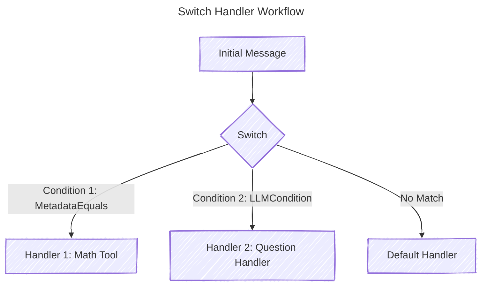

# Table of Contents

1. [Introduction](#introduction)
2. [Middleware Support in Handlers](#middleware-support-in-handlers)
3. [The First Handler](#the-first-handler)
4. [The Switch Handler: Conditional Routing for Conversation Threads](#the-switch-handler-conditional-routing-for-conversation-threads)

<a id="middleware-support-in-handlers"></a>

# Middleware Support in Handlers

The handlers in this package (`Switch`, `First`, `For`, `Must`) all support middleware through a consistent interface. This allows you to add cross-cutting concerns like logging, timeouts, retries, or validation to your handlers without modifying their core logic.

## Key Concepts

### Handlers with Middleware Support

Each handler that supports middleware implements two key methods:

1. **Use(middleware ...minds.Middleware)**: Adds middleware to the handler, which will be applied to all operations processed by this handler.

2. **With(middleware ...minds.Middleware) minds.ThreadHandler**: Creates a new handler with the same configuration plus additional middleware, preserving the original handler.

### Middleware Ordering

Middleware is applied in reverse order to create proper nesting. This means:

- The first middleware you add is the outermost wrapper (first to start, last to finish)
- The last middleware you add is the innermost wrapper (last to start, first to finish)

For example:
```go
handler.Use(loggingMiddleware, timeoutMiddleware)
```

The execution flow will be:
1. loggingMiddleware starts
2. timeoutMiddleware starts
3. handler executes
4. timeoutMiddleware finishes
5. loggingMiddleware finishes

## Example: Adding Middleware to Handlers

```go
// Create a logging middleware
loggingMiddleware := minds.MiddlewareFunc(func(next minds.ThreadHandler) minds.ThreadHandler {
    return minds.ThreadHandlerFunc(func(tc minds.ThreadContext, _ minds.ThreadHandler) (minds.ThreadContext, error) {
        fmt.Println("Starting handler execution")
        result, err := next.HandleThread(tc, nil)
        fmt.Println("Finished handler execution")
        return result, err
    })
})

// Create a retry middleware
retryMiddleware := minds.MiddlewareFunc(func(next minds.ThreadHandler) minds.ThreadHandler {
    return minds.ThreadHandlerFunc(func(tc minds.ThreadContext, _ minds.ThreadHandler) (minds.ThreadContext, error) {
        var lastErr error
        for attempts := 0; attempts < 3; attempts++ {
            result, err := next.HandleThread(tc, nil)
            if err == nil {
                return result, nil
            }
            lastErr = err
            time.Sleep(100 * time.Millisecond)
        }
        return tc, fmt.Errorf("failed after 3 attempts: %w", lastErr)
    })
})

// Apply middleware to a First handler
firstHandler := handlers.NewFirst("validation", validateA, validateB, validateC)
firstHandler.Use(loggingMiddleware, retryMiddleware)

// Create a new handler with additional middleware
timeoutMiddleware := NewTimeout(5 * time.Second)
enhancedHandler := firstHandler.With(timeoutMiddleware)
```

## Middleware in Complex Handler Hierarchies

When you have handlers that contain other handlers (like `Switch` containing case handlers, or `First` containing multiple parallel handlers), middleware is applied at different levels:

1. **Parent-level middleware**: Applied to the parent handler's operations.
2. **Child-level middleware**: Applied directly to individual child handlers.

Example with a Switch handler:

```go
// Create a Switch handler with middleware
switchHandler := handlers.NewSwitch("router", defaultHandler,
    handlers.SwitchCase{Condition: conditionA, Handler: handlerA},
    handlers.SwitchCase{Condition: conditionB, Handler: handlerB},
)

// Add middleware to the Switch handler
switchHandler.Use(loggingMiddleware)

// The middleware will be applied to the handler that matches a condition
```

## Middleware Best Practices

1. **Keep middleware focused**: Each middleware should have a single responsibility.
2. **Consider order**: The order of middleware matters for nesting behavior.
3. **Use With() for variations**: Use `With()` to create variations of a handler with different middleware.
4. **Compose middleware**: Create reusable middleware compositions for common patterns.

<a id="the-first-handler"></a>

# First Handler

The `First` handler is designed to execute multiple handlers in parallel and return the result of the first successful handler. This is particularly useful in scenarios where you have multiple ways to achieve the same goal, and you want to proceed as soon as one of them succeeds. If all handlers fail, it aggregates the errors and returns them.

---

### Analogy: The Race to Success

Think of the `First` handler as a **race** where multiple runners (handlers) are competing to reach the finish line (success). The moment one runner crosses the line, the race is over, and the other runners stop. If no runner finishes successfully, the race is considered a failure, and you get a report of what went wrong with each runner.

This pattern is similar to:
- **Load Balancing with Fallbacks**: Trying multiple servers to handle a request and using the first successful response.
- **Redundant Validation**: Validating data using multiple methods and accepting the first valid result.
- **Competing Algorithms**: Running different algorithms in parallel and using the first one that produces a valid result.

---

### Key Features:
1. **Concurrent Execution**: All handlers run in parallel, maximizing efficiency.
2. **First Success Wins**: As soon as one handler succeeds, the rest are canceled.
3. **Error Aggregation**: If all handlers fail, all errors are collected and returned.
4. **Graceful Fallback**: If no handlers are provided, the input is passed through to the next handler in the chain.
5. **Middleware Support**: Add cross-cutting concerns using the `Use()` and `With()` methods.

---

### Example Use Case

Imagine you're building a conversational AI system, and you want to validate user input using multiple methods. You might have:
- A **rule-based validator** (fast but less accurate).
- A **machine learning validator** (slower but more accurate).
- A **fallback validator** (basic checks).

You want to use the first validator that succeeds, and if all fail, return an error.

```go
// Create validators
ruleBasedValidator := createRuleValidator()
mlValidator := createMLValidator()
fallbackValidator := createFallbackValidator()

// Create a logging middleware
loggingMiddleware := minds.MiddlewareFunc(func(next minds.ThreadHandler) minds.ThreadHandler {
    return minds.ThreadHandlerFunc(func(tc minds.ThreadContext, _ minds.ThreadHandler) (minds.ThreadContext, error) {
        fmt.Println("Starting validation")
        result, err := next.HandleThread(tc, nil)
        if err != nil {
            fmt.Println("Validation failed:", err)
        } else {
            fmt.Println("Validation succeeded")
        }
        return result, err
    })
})

// Create First handler with middleware
first := handlers.NewFirst("validation", 
    ruleBasedValidator,
    mlValidator,
    fallbackValidator,
)
first.Use(loggingMiddleware)

// Process the input
result, err := first.HandleThread(inputContext, nil)
if err != nil {
    log.Fatalf("Validation failed: %v", err)
}
fmt.Println("Validated input:", result)
```

---

### How It Works

1. **Setup**: The `First` handler is initialized with a name and a list of handlers to execute.
2. **Middleware**: Optional middleware can be added with `Use()` or `With()`.
3. **Execution**:
   - All handlers are run concurrently using goroutines.
   - Each handler gets its own isolated context.
   - Middleware is applied to each handler execution.
   - The first handler to succeed sends its result to a channel.
   - Once a result is received, the context is canceled to stop the remaining handlers.
4. **Result Handling**:
   - If a handler succeeds, its result is returned.
   - If all handlers fail, an aggregated error is returned.
5. **Fallback**: If no handlers are provided, the input is passed through to the next handler in the chain.

---

### Code Breakdown

#### Initialization
```go
first := handlers.NewFirst("validation",
    validateA,
    validateB,
    validateC,
)
```
- `"validation"`: A name for the handler group (useful for debugging and logging).
- `validateA`, `validateB`, `validateC`: Handlers to execute in parallel.

#### Adding Middleware
```go
// Add middleware directly
first.Use(loggingMiddleware, retryMiddleware)

// Or create a new handler with additional middleware
enhancedFirst := first.With(timeoutMiddleware)
```

#### Execution
```go
result, err := first.HandleThread(inputContext, nil)
```
- `inputContext`: The initial conversation thread or data to process.
- `nil`: The next handler in the chain (optional).

#### Error Handling
```go
if err != nil {
    log.Fatalf("Validation failed: %v", err)
}
```
- If all handlers fail, the error contains details about each failure.

---

### Why Use the `First` Handler?

1. **Efficiency**: By running handlers in parallel, you reduce the overall processing time.
2. **Flexibility**: You can define multiple strategies for handling a task and let the system choose the best one.
3. **Robustness**: If one strategy fails, others can still succeed, improving reliability.
4. **Error Insights**: Aggregated errors provide a comprehensive view of what went wrong.
5. **Middleware Support**: Add cross-cutting concerns like logging or retries without modifying handler logic.

---

### Real-World Scenarios

1. **Validation**: Use multiple validation methods and accept the first valid result.
2. **Fallback Mechanisms**: Try multiple ways to generate a response (e.g., LLM, rule-based, cached responses).
3. **Redundant Systems**: Attempt to fetch data from multiple sources and use the first successful response.
4. **Competing Algorithms**: Run different algorithms in parallel and use the first valid output.

---

### Example: Fallback Response Generation

```go
// Create handlers for different response generation strategies
llmGenerator := createLLMGenerator()
ruleBasedGenerator := createRuleBasedGenerator()
cachedResponseGenerator := createCachedResponseGenerator()

// Add logging middleware
loggingMiddleware := createLoggingMiddleware("response-generation")

// Create First handler with middleware
responseGenerator := handlers.NewFirst("response-generation",
    llmGenerator,
    ruleBasedGenerator,
    cachedResponseGenerator,
)
responseGenerator.Use(loggingMiddleware)

// Generate a response
result, err := responseGenerator.HandleThread(inputContext, nil)
if err != nil {
    log.Fatalf("Failed to generate response: %v", err)
}
fmt.Println("Generated response:", result)
```

In this example:
- The system first tries to generate a response using an LLM.
- If that fails, it falls back to a rule-based response.
- If that also fails, it uses a cached response.
- The first successful response is returned.
- The logging middleware tracks the process.

---

### Summary

The `First` handler is a powerful tool for building resilient and efficient systems. By running multiple strategies in parallel and using the first successful result, you can improve both performance and reliability. With built-in middleware support, you can easily add cross-cutting concerns like logging, retries, or timeouts without modifying the core handler logic.

---

# The Switch Handler: Conditional Routing for Conversation Threads

The **Switch** handler is a powerful tool for building conditional logic into your conversation processing pipelines. It allows you to route threads to different handlers based on dynamic conditions, such as metadata, LLM evaluations, or custom logic. This is particularly useful when you need to handle different types of user inputs or tasks within a single conversational flow.

---

## Why Use the Switch Handler?

The **Switch** handler is ideal for scenarios where you need to:
1. **Route Messages Based on Metadata**: For example, directing a message to a specific handler if it contains a certain metadata key or value.
2. **Evaluate Conditions with LLMs**: Use an LLM to determine which handler should process the message (e.g., "Is this a math question?").
3. **Implement Fallback Logic**: Provide a default handler when no conditions match.
4. **Organize Complex Workflows**: Break down large conversational flows into smaller, manageable handlers.
5. **Apply Middleware to Specific Routes**: Add middleware to apply only when certain conditions are met.

---

### Switch vs. LLM Tool Usage

While LLM tool usage (e.g., function calling) can handle conditional logic, the **Switch** handler offers several advantages:
- **Explicit Control**: Conditions are explicitly defined, making the logic easier to understand and debug.
- **Efficiency**: Avoids unnecessary LLM calls by evaluating conditions directly (e.g., metadata checks).
- **Flexibility**: Supports custom conditions (e.g., Lua scripts, metadata checks) alongside LLM-based evaluations.
- **Performance**: Reduces latency by minimizing reliance on LLMs for simple routing decisions.
- **Middleware Support**: Apply middleware to specific routing paths without affecting others.

Use **Switch** when you need clear, structured routing logic. Use LLM tool usage when the decision-making process is complex and requires natural language understanding.

---

## How It Works

The **Switch** handler evaluates a list of conditions in order. When a condition evaluates to `true`, the corresponding handler is executed. If no conditions match, a default handler (if provided) is used. Middleware can be applied to the entire switch or specific cases.

### Key Components

1. **SwitchCondition**: An interface for defining conditions. Built-in implementations include:
   - **MetadataEquals**: Checks if a metadata key matches a specific value.
   - **LLMCondition**: Uses an LLM to evaluate a condition based on a prompt.
2. **SwitchCase**: Pairs a condition with a handler.
3. **Default Handler**: Executed when no conditions match.
4. **Middleware Support**: Add middleware to the switch handler with `Use()` or create variations with `With()`.

---

### Example: Routing Messages Based on Metadata and LLM Evaluation



```go
func main() {
	llm, _ := openai.NewProvider()

	// Define conditions and handlers
	mathCondition := handlers.MetadataEquals{Key: "type", Value: "math"}
	mathHandler := tools.NewCalculator()

	questionCondition := handlers.LLMCondition{
		Generator: llm,
		Prompt:    "Is this message a general knowledge question?",
	}
	questionHandler := handlers.NewQuestionHandler(llm)

	defaultHandler := handlers.NewDefaultHandler(llm)

	// Create logging middleware
	loggingMiddleware := minds.MiddlewareFunc(func(next minds.ThreadHandler) minds.ThreadHandler {
		return minds.ThreadHandlerFunc(func(tc minds.ThreadContext, _ minds.ThreadHandler) (minds.ThreadContext, error) {
			fmt.Println("Processing message:", tc.Messages().Last().Content)
			result, err := next.HandleThread(tc, nil)
			if err == nil {
				fmt.Println("Response:", result.Messages().Last().Content)
			}
			return result, err
		})
	})

	// Create the Switch handler with middleware
	sw := handlers.NewSwitch("router",
		defaultHandler,
		handlers.SwitchCase{Condition: mathCondition, Handler: mathHandler},
		handlers.SwitchCase{Condition: questionCondition, Handler: questionHandler},
	)
	sw.Use(loggingMiddleware)

	// Initial thread with metadata
	thread := minds.NewThreadContext(context.Background()).
		WithMessages(minds.Messages{
			{Role: minds.RoleUser, Content: "What is 7 * 12 + 5?"},
		}).
		WithMetadata(map[string]any{
			"type": "math",
		})

	// Process the thread
	result, err := sw.HandleThread(thread, nil)
	if err != nil {
		log.Fatalf("Error processing thread: %v", err)
	}
	fmt.Println("Final response:", result.Messages().Last().Content)
}
```

---

### Built-In Conditions

#### 1. MetadataEquals
Checks if a metadata key matches a specific value.

```go
condition := handlers.MetadataEquals{Key: "type", Value: "math"}
```

#### 2. LLMCondition
Uses an LLM to evaluate a condition based on a prompt.

```go
condition := handlers.LLMCondition{
    Generator: llm,
    Prompt:    "Is this message a general knowledge question?",
}
```

---

### Custom Conditions

You can implement the `SwitchCondition` interface to create custom conditions. For example, a Lua-based condition:

```go
type LuaCondition struct {
    Script string
}

func (l LuaCondition) Evaluate(tc minds.ThreadContext) (bool, error) {
    // Execute Lua script and return result
}
```

---

### Middleware Support

The Switch handler supports middleware through two methods:

1. **Use()**: Add middleware to be applied when a case matches.

```go
sw := handlers.NewSwitch("router", defaultHandler, cases...)
sw.Use(loggingMiddleware, timeoutMiddleware)
```

2. **With()**: Create a new switch handler with additional middleware.

```go
enhancedSwitch := sw.With(monitoringMiddleware)
```

Middleware is applied to the handler of the matching case, not to the condition evaluation process.

---

### Why Use the Switch Handler?

1. **Modularity**: Break down complex workflows into smaller, reusable handlers.
2. **Flexibility**: Combine metadata checks, LLM evaluations, and custom logic.
3. **Efficiency**: Avoid unnecessary LLM calls for simple routing decisions.
4. **Debugging**: Explicit conditions make it easier to trace and debug issues.
5. **Middleware Support**: Apply cross-cutting concerns to specific routing paths.

---

### Real-World Use Cases

1. **Intent Routing**: Direct messages to specific handlers based on user intent (e.g., "Is this a question or a command?").
2. **Fallback Mechanisms**: Provide a default response when no conditions match.
3. **Dynamic Workflows**: Adapt the conversation flow based on metadata or LLM evaluations.
4. **Tool Integration**: Route messages to external tools (e.g., calculators, APIs) based on content.

---

### Example: Intent-Based Routing with Middleware

```go
// Create middleware for different routes
monitoringMiddleware := createMonitoringMiddleware()
loggingMiddleware := createLoggingMiddleware()
retryMiddleware := createRetryMiddleware(3)

// Create handlers
calculatorHandler := tools.NewCalculator()
questionHandler := handlers.NewQuestionHandler(llm)
defaultHandler := handlers.NewDefaultHandler(llm)

// Apply handler-specific middleware
calculatorHandler = calculatorHandler.With(monitoringMiddleware)
questionHandler.Use(retryMiddleware)

// Create the Switch handler with global middleware
sw := handlers.NewSwitch("intent-router",
    defaultHandler,
    handlers.SwitchCase{
        Condition: handlers.LLMCondition{
            Generator: llm,
            Prompt:    "Does this message contain a mathematical calculation?",
        },
        Handler: calculatorHandler,
    },
    handlers.SwitchCase{
        Condition: handlers.MetadataEquals{
            Key:   "type",
            Value: "question",
        },
        Handler: questionHandler,
    },
)
sw.Use(loggingMiddleware)
```

In this example:
- The calculator handler has monitoring middleware.
- The question handler has retry middleware.
- All routes have logging middleware applied via the Switch handler.

---

### Summary

The **Switch** handler is a versatile tool for building conditional logic into your conversational AI pipelines. It provides explicit, efficient, and flexible routing capabilities, making it easier to manage complex workflows. With built-in middleware support, you can easily add cross-cutting concerns like logging, monitoring, or retries to specific routing paths or the entire switch.

---

# The FreeformExtractor Handler: Extract Name-Value Pairs from Conversations

The **FreeformExtractor** handler analyzes conversation messages in a ThreadContext and extracts key information as name-value pairs, which are then stored in the ThreadContext's metadata. This is particularly useful for extracting structured information from unstructured conversations, such as customer details in a support chat or product preferences in a sales conversation.

---

## Why Use the FreeformExtractor Handler?

The **FreeformExtractor** handler is ideal for scenarios where you need to:
1. **Extract Key Information**: Pull relevant data points from conversation history.
2. **Create Structured Metadata**: Transform unstructured conversation into structured data.
3. **Enable Conditional Processing**: Use extracted data for downstream decision-making.
4. **Analyze Conversation Context**: Understand the context of a conversation for better handling.
5. **Apply Cross-Cutting Concerns**: Use middleware to add logging, validation, or other functionality.

---

### Key Components

1. **Content Generator**: An LLM provider that processes the conversation and extracts data.
2. **Extraction Prompt**: Instructions for the LLM on what information to extract.
3. **Middleware Support**: Add cross-cutting concerns with `Use()` or create variations with `With()`.
4. **Metadata Integration**: Store extracted data directly in the ThreadContext's metadata.

---

### Example: Extracting Customer Information

```go
// Create an OpenAI provider
llm, _ := openai.NewProvider()

// Create an extraction prompt
prompt := `Extract key information from this customer support conversation.
Look for the customer's name, age, email, and the problem they're experiencing.
Format the response as an array of key-value pairs, where each pair includes a "key" field and a "value" field.
For example: [{"key": "name", "value": "John Smith"}, {"key": "age", "value": "35"}]`

// Create the FreeformExtractor handler
extractor := handlers.NewFreeformExtractor("customer-info", llm, prompt)

// Add logging middleware
extractor.Use(loggingMiddleware)

// Process a thread with conversation messages
result, err := extractor.HandleThread(threadContext, nil)
if err != nil {
    log.Fatalf("Error extracting data: %v", err)
}

// Access the extracted data in metadata
name := result.Metadata()["name"]
age := result.Metadata()["age"]
email := result.Metadata()["email"]
problem := result.Metadata()["problem"]

fmt.Printf("Customer %s (age: %v, email: %s) reported: %s\n", 
    name, age, email, problem)
```

---

### How It Works

1. **Setup**: The handler is initialized with a name, a content generator (LLM), and an extraction prompt.
2. **Processing**:
   - The extractor creates a system message with the provided prompt.
   - It adds the conversation messages as context.
   - It defines a response schema for an array of key-value pairs.
   - It sends the request to the LLM for extraction.
   - It parses the response and adds the extracted key-value pairs to the thread context's metadata.
   - It automatically converts string values to appropriate types (numbers, booleans, etc.).
3. **Middleware**: Optional middleware can be applied with `Use()` or new handlers created with `With()`.
4. **Next Handler**: If provided, the next handler is executed with the updated thread context.

---

### Real-World Use Cases

1. **Customer Support Systems**: Extract customer details and issues for automated routing.
2. **Sales Conversations**: Identify product preferences and requirements.
3. **Interview Analysis**: Extract candidate qualifications and experience.
4. **Medical Consultations**: Extract symptoms and medical history from patient conversations.
5. **Knowledge Base Building**: Extract facts and relationships from conversational content.

---

### Best Practices

1. **Clear Instructions**: Make the extraction prompt specific and clear about what information to extract.
2. **Handle Missing Data**: Design your extractor to be robust when information is missing.
3. **Use Middleware**: Add validation or transformation logic with middleware.
4. **Chain with Other Handlers**: Use the extracted data with Switch or other conditional handlers.
5. **Test Thoroughly**: Verify extraction accuracy with different conversation patterns.

---

# The StructuredExtractor Handler: Extract Structured Data from Conversations

The **StructuredExtractor** handler analyzes conversation messages in a ThreadContext and extracts structured data according to a predefined schema. This structured data is then stored in the ThreadContext's metadata using the schema name as the key. This handler is particularly useful when you need to extract complex, structured information that conforms to a specific data model.

---

## Why Use the StructuredExtractor Handler?

The **StructuredExtractor** handler is ideal for scenarios where you need to:
1. **Extract Complex Data Structures**: Pull nested or related data points from conversations.
2. **Enforce Data Schema**: Ensure extracted data conforms to a specific structure.
3. **Support Type Validation**: Extract data with the correct types (strings, numbers, booleans).
4. **Enable Advanced Processing**: Use structured data for complex downstream operations.
5. **Integrate with Typed Systems**: Extract data that can be easily marshaled into Go structs.

---

### Key Components

1. **Content Generator**: An LLM provider that processes the conversation and extracts data.
2. **Extraction Prompt**: Instructions for the LLM on what information to extract.
3. **Response Schema**: A structural definition of the data to extract.
4. **Middleware Support**: Add cross-cutting concerns with `Use()` or create variations with `With()`.
5. **Metadata Integration**: Store extracted structured data in the ThreadContext's metadata.

---

### Example: Extracting Product Order Information

```go
// Define a schema for order information
type OrderInfo struct {
    ProductName  string  `json:"product_name"`
    Quantity     int     `json:"quantity"`
    Price        float64 `json:"price"`
    ShippingAddr string  `json:"shipping_address"`
}

// Create a response schema
schema, _ := minds.NewResponseSchema("order_details", "Order information", OrderInfo{})

// Create an OpenAI provider
llm, _ := openai.NewProvider()

// Create an extraction prompt
prompt := `Extract order information from this customer conversation.
Identify the product name, quantity, price, and shipping address.
Format the response according to the provided schema.`

// Create the StructuredExtractor handler
extractor := handlers.NewStructuredExtractor("order-extractor", llm, prompt, *schema)

// Process a thread with conversation messages
result, err := extractor.HandleThread(threadContext, nil)
if err != nil {
    log.Fatalf("Error extracting data: %v", err)
}

// Access the extracted structured data in metadata
orderData := result.Metadata()["order_details"].(map[string]interface{})
productName := orderData["product_name"].(string)
quantity := int(orderData["quantity"].(float64))
price := orderData["price"].(float64)
address := orderData["shipping_address"].(string)

fmt.Printf("Order: %d x %s at $%.2f to be shipped to %s\n",
    quantity, productName, price, address)
```

---

### How It Works

1. **Setup**: The handler is initialized with a name, a content generator (LLM), an extraction prompt, and a response schema.
2. **Processing**:
   - The extractor creates a system message with the provided prompt.
   - It adds the conversation messages as context.
   - It sends the request to the LLM with the provided schema.
   - It parses the structured response and stores it in the thread context's metadata using the schema name as the key.
3. **Middleware**: Optional middleware can be applied with `Use()` or new handlers created with `With()`.
4. **Next Handler**: If provided, the next handler is executed with the updated thread context.

---

### Real-World Use Cases

1. **E-commerce Systems**: Extract order details from customer conversations.
2. **Travel Booking**: Extract travel preferences, dates, and destinations.
3. **Financial Services**: Extract transaction details or financial planning requirements.
4. **Healthcare**: Extract patient information in a structured format for electronic health records.
5. **Event Planning**: Extract event details, attendees, and requirements.

---

### Best Practices

1. **Design Clear Schemas**: Make your data structure intuitive and focused on essential information.
2. **Provide Detailed Prompts**: Clearly instruct the LLM on how to map conversation elements to schema fields.
3. **Handle Type Conversion**: Remember that JSON unmarshaling converts numbers to float64 by default.
4. **Use Schema Validation**: Include constraints in your schema to ensure data quality.
5. **Chain with Conditional Logic**: Use the extracted structured data with Switch handlers for conditional processing.

---

### Comparison: FreeformExtractor vs. StructuredExtractor

| Feature | FreeformExtractor | StructuredExtractor |
|---------|-------------------|---------------------|
| **Data Structure** | Simple key-value pairs | Complex structured data |
| **Schema Definition** | Internal, fixed schema | Custom, user-defined schema |
| **Metadata Storage** | Multiple keys in metadata | Single key with nested structure |
| **Type Enforcement** | Limited | Comprehensive |
| **Use Case** | Simple data extraction | Complex data modeling |

Use **FreeformExtractor** when you need to extract simple key-value data without a predefined structure. Use **StructuredExtractor** when you need to extract complex, structured data that conforms to a specific schema.

---

