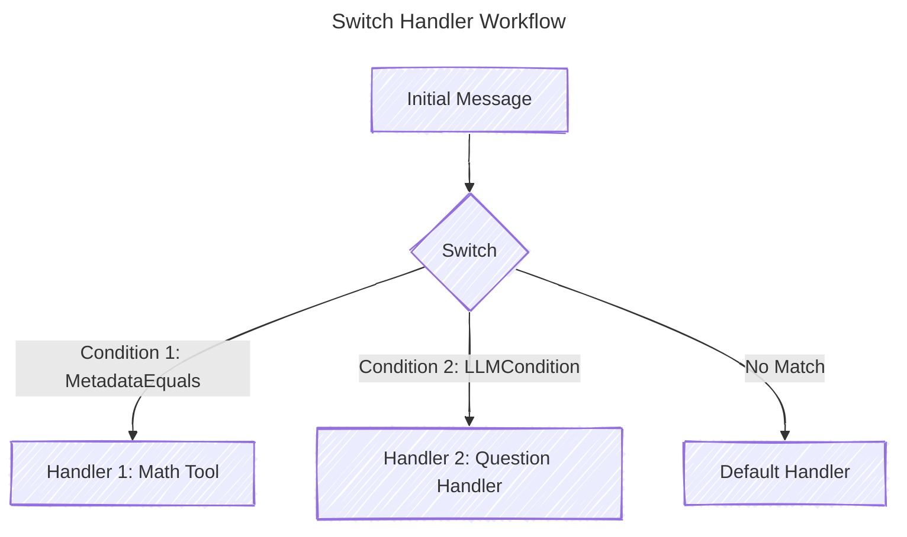

# Table of Contents

1. [Introduction](#introduction)
2. [The First Handler](#the-first-handler)
3. [ThreadFlow](#threadflow)
4. [The Switch Handler: Conditional Routing for Conversation Threads](#the-switch-handler-conditional-routing-for-conversation-threads)

<a id="the-first-handler"></a>

# First Handler

The `First` handler is designed to execute multiple handlers in parallel and return the result of the first successful handler. This is particularly useful in scenarios where you have multiple ways to achieve the same goal, and you want to proceed as soon as one of them succeeds. If all handlers fail, it aggregates the errors and returns them.

---

### Analogy: The Race to Success

Think of the `First` handler as a **race** where multiple runners (handlers) are competing to reach the finish line (success). The moment one runner crosses the line, the race is over, and the other runners stop. If no runner finishes successfully, the race is considered a failure, and you get a report of what went wrong with each runner.

This pattern is similar to:
- **Load Balancing with Fallbacks**: Trying multiple servers to handle a request and using the first successful response.
- **Redundant Validation**: Validating data using multiple methods and accepting the first valid result.
- **Competing Algorithms**: Running different algorithms in parallel and using the first one that produces a valid result.

---

### Key Features:
1. **Concurrent Execution**: All handlers run in parallel, maximizing efficiency.
2. **First Success Wins**: As soon as one handler succeeds, the rest are canceled.
3. **Error Aggregation**: If all handlers fail, all errors are collected and returned.
4. **Graceful Fallback**: If no handlers are provided, the input is passed through to the next handler in the chain.

---

### Example Use Case

Imagine you’re building a conversational AI system, and you want to validate user input using multiple methods. You might have:
- A **rule-based validator** (fast but less accurate).
- A **machine learning validator** (slower but more accurate).
- A **fallback validator** (basic checks).

You want to use the first validator that succeeds, and if all fail, return an error.

```go
first := handlers.First("validation",
    ruleBasedValidator,
    mlValidator,
    fallbackValidator,
)

result, err := first.HandleThread(inputContext, nil)
if err != nil {
    log.Fatalf("Validation failed: %v", err)
}
fmt.Println("Validated input:", result)
```

---

### How It Works

1. **Setup**: The `First` handler is initialized with a name and a list of handlers to execute.
2. **Execution**:
   - All handlers are run concurrently using goroutines.
   - The first handler to succeed sends its result to a channel.
   - Once a result is received, the context is canceled to stop the remaining handlers.
3. **Result Handling**:
   - If a handler succeeds, its result is returned.
   - If all handlers fail, an aggregated error is returned.
4. **Fallback**: If no handlers are provided, the input is passed through to the next handler in the chain.

---

### Code Breakdown

#### Initialization
```go
first := handlers.First("validation",
    validateA,
    validateB,
    validateC,
)
```
- `"validation"`: A name for the handler group (useful for debugging and logging).
- `validateA`, `validateB`, `validateC`: Handlers to execute in parallel.

#### Execution
```go
result, err := first.HandleThread(inputContext, nil)
```
- `inputContext`: The initial conversation thread or data to process.
- `nil`: The next handler in the chain (optional).

#### Error Handling
```go
if err != nil {
    log.Fatalf("Validation failed: %v", err)
}
```
- If all handlers fail, the error contains details about each failure.

---

### Why Use the `First` Handler?

1. **Efficiency**: By running handlers in parallel, you reduce the overall processing time.
2. **Flexibility**: You can define multiple strategies for handling a task and let the system choose the best one.
3. **Robustness**: If one strategy fails, others can still succeed, improving reliability.
4. **Error Insights**: Aggregated errors provide a comprehensive view of what went wrong.

---

### Real-World Scenarios

1. **Validation**: Use multiple validation methods and accept the first valid result.
2. **Fallback Mechanisms**: Try multiple ways to generate a response (e.g., LLM, rule-based, cached responses).
3. **Redundant Systems**: Attempt to fetch data from multiple sources and use the first successful response.
4. **Competing Algorithms**: Run different algorithms in parallel and use the first valid output.

---

### Example: Fallback Response Generation

```go
flow := NewThreadFlow("conversation")
flow.Use(NewLogging("audit"))

flow.Handle(handlers.First("response-generation",
    generateLLMResponse,
    generateRuleBasedResponse,
    generateCachedResponse,
))

result, err := flow.HandleThread(inputContext, nil)
if err != nil {
    log.Fatalf("Failed to generate response: %v", err)
}
fmt.Println("Generated response:", result)
```

In this example:
- The system first tries to generate a response using an LLM.
- If that fails, it falls back to a rule-based response.
- If that also fails, it uses a cached response.
- The first successful response is returned.

---

### Summary

The `First` handler is a powerful tool for building resilient and efficient systems. By running multiple strategies in parallel and using the first successful result, you can improve both performance and reliability. Whether you're validating input, generating responses, or fetching data, the `First` handler ensures that your system can adapt and succeed even when individual components fail.

<a href="#>
# ThreadFlow

A **ThreadFlow** is similar to an HTTP router like Chi or Flow, but instead of routing HTTP requests, it manages the flow of conversation threads through different processing stages. Just as an HTTP router directs requests through middleware and handlers, ThreadFlow guides conversation threads through a series of processing steps.

Consider this HTTP router example:

```go
router := chi.NewRouter()
router.Use(middleware.Logger)        // Global middleware
router.Use(middleware.Recoverer)     // Another global middleware

router.Group(func(r chi.Router) {
    r.Use(middleware.Timeout(5 * time.Second))  // Group-specific middleware
    r.Get("/api/users", handleUsers)           // Route handler
    r.Get("/api/posts", handlePosts)           // Another handler
})
```

ThreadFlow follows a similar pattern but for conversation processing:

```go
flow := NewThreadFlow("conversation")
flow.Use(NewLogging("audit"))          // Global middleware logs all operations

flow.Handle(validateInput)             // Base handler for input validation

flow.Group(func(f *ThreadFlow) {
    f.Use(NewTimeout("timeout", 5))    // Group-specific timeout
    f.Use(NewRetry("retry", 3))        // Group-specific retry logic
    f.Handle(generateResponse)         // Handler for LLM response
    f.Handle(validateOutput)           // Handler for output validation
})
```

The key difference is that while HTTP routers process web requests, ThreadFlow processes conversation threads. Each handler in ThreadFlow can modify the conversation state, add messages, or update metadata, while middleware can add cross-cutting concerns like logging, timeouts, or retries.

Just as HTTP middleware can inspect or modify a request before it reaches the handler, ThreadFlow middleware can examine or transform the conversation thread before it reaches each processing stage. This makes it easy to add capabilities like:

1. **Logging**: Track each stage of conversation processing.
2. **Timeouts**: Set limits for how long LLM operations can take.
3. **Retries**: Automatically retry failed operations.
4. **Validation**: Ensure conversation content meets specific criteria.
5. **State Management**: Maintain and update conversation context.

The ThreadFlow pattern is particularly valuable when building complex conversational applications that require multiple processing steps, each with different requirements for reliability, timing, and validation.

This architecture keeps your conversation processing logic organized and maintainable, just as a well-structured HTTP router keeps your web application organized. The ability to group handlers and apply specific middleware to those groups gives you fine-grained control over how different parts of your conversation processing pipeline behave.

A **ThreadFlow** is essentially a manager for handling a sequence of tasks (called "handlers") and applying additional processing steps (called "middleware") to those tasks. Think of it as a way to organize and control how a series of operations are executed, with the ability to add extra behavior (like logging, retries, or timeouts) around those operations.

### Key Concepts:

1. **Handlers**: These are the main tasks or operations you want to perform. For example, validating data, processing content, or saving something to a database.

2. **Middleware**: These are additional steps that wrap around your handlers. They can modify the input, output, or behavior of the handlers. For example, logging the start and end of a task, retrying a task if it fails, or setting a timeout for how long a task can run.

3. **ThreadFlow**: This is the top-level manager that organizes your handlers and middleware. It allows you to:
   - Add global middleware that applies to all handlers.
   - Group handlers and apply specific middleware only to that group.

### How It Works:

- **Global Middleware**: You can add middleware that will apply to all handlers in the ThreadFlow. For example, you might want to log every task that runs.

- **Grouped Middleware**: You can create groups of handlers and apply middleware only to those groups. This is useful when you want certain middleware (like retries or timeouts) to apply only to specific tasks.

### Example Breakdown:

```go
// Create a new ThreadFlow
flow := NewThreadFlow("example")

// Add global middleware (applies to all handlers)
flow.Use(NewLogging("audit"))

// Add base handlers
flow.Handle(seq)

// Create a group with specific middleware
flow.Group(func(f *ThreadFlow) {
    f.Use(NewRetry("retry", 3))    // Retry up to 3 times
    f.Use(NewTimeout("timeout", 5)) // Timeout after 5 seconds
    f.Handle(NewContentProcessor("content")) // Add a handler
    f.Handle(NewValidator("validate"))       // Add another handler
})

// Execute the flow
result, err := flow.HandleThread(initialContext, nil)
if err != nil {
    log.Fatalf("Error in flow: %v", err)
}
fmt.Println("Result:", result.Messages().Last().Content)
```

### What Happens Here:

1. **Global Middleware**: The `NewLogging("audit")` middleware is added globally, so it will log every handler that runs.

2. **Base Handlers**: The `seq` handler is added to the flow. This could be a sequence of tasks like validation and processing.

3. **Grouped Handlers**: Inside the `Group` function, two middleware (`NewRetry` and `NewTimeout`) are added, and two handlers (`NewContentProcessor` and `NewValidator`) are added. These middleware will only apply to the handlers within this group.

4. **Execution**: When `flow.HandleThread` is called, the flow executes all handlers in sequence, applying the appropriate middleware to each one.

### Why Use ThreadFlow?

- **Flexibility**: You can easily add or remove middleware for specific tasks without affecting others.
- **Organization**: It helps keep your code clean and organized by grouping related tasks and their middleware together.
- **Reusability**: Middleware can be reused across different groups or flows, reducing code duplication.

In summary, a **ThreadFlow** is a powerful tool for managing and orchestrating a series of tasks with the ability to add and control additional behavior around those tasks. It’s like having a conductor for your orchestra of handlers and middleware, ensuring everything runs smoothly and efficiently.

---

# The Switch Handler: Conditional Routing for Conversation Threads

The **Switch** handler is a powerful tool for building conditional logic into your conversation processing pipelines. It allows you to route threads to different handlers based on dynamic conditions, such as metadata, LLM evaluations, or custom logic. This is particularly useful when you need to handle different types of user inputs or tasks within a single conversational flow.

---

## Why Use the Switch Handler?

The **Switch** handler is ideal for scenarios where you need to:
1. **Route Messages Based on Metadata**: For example, directing a message to a specific handler if it contains a certain metadata key or value.
2. **Evaluate Conditions with LLMs**: Use an LLM to determine which handler should process the message (e.g., "Is this a math question?").
3. **Implement Fallback Logic**: Provide a default handler when no conditions match.
4. **Organize Complex Workflows**: Break down large conversational flows into smaller, manageable handlers.

---

### Switch vs. LLM Tool Usage

While LLM tool usage (e.g., function calling) can handle conditional logic, the **Switch** handler offers several advantages:
- **Explicit Control**: Conditions are explicitly defined, making the logic easier to understand and debug.
- **Efficiency**: Avoids unnecessary LLM calls by evaluating conditions directly (e.g., metadata checks).
- **Flexibility**: Supports custom conditions (e.g., Lua scripts, metadata checks) alongside LLM-based evaluations.
- **Performance**: Reduces latency by minimizing reliance on LLMs for simple routing decisions.

Use **Switch** when you need clear, structured routing logic. Use LLM tool usage when the decision-making process is complex and requires natural language understanding.

---

## How It Works

The **Switch** handler evaluates a list of conditions in order. When a condition evaluates to `true`, the corresponding handler is executed. If no conditions match, a default handler (if provided) is used.

### Key Components

1. **SwitchCondition**: An interface for defining conditions. Built-in implementations include:
   - **MetadataEquals**: Checks if a metadata key matches a specific value.
   - **LLMCondition**: Uses an LLM to evaluate a condition based on a prompt.
2. **SwitchCase**: Pairs a condition with a handler.
3. **Default Handler**: Executed when no conditions match.

---

### Example: Routing Messages Based on Metadata and LLM Evaluation



```go
func main() {
	llm, _ := openai.NewProvider()

	// Define conditions and handlers
	mathCondition := handlers.MetadataEquals{Key: "type", Value: "math"}
	mathHandler := tools.NewCalculator()

	questionCondition := handlers.LLMCondition{
		Generator: llm,
		Prompt:    "Is this message a general knowledge question?",
	}
	questionHandler := handlers.NewQuestionHandler(llm)

	defaultHandler := handlers.NewDefaultHandler(llm)

	// Create the Switch handler
	sw := handlers.Switch("router",
		defaultHandler,
		handlers.SwitchCase{Condition: mathCondition, Handler: mathHandler},
		handlers.SwitchCase{Condition: questionCondition, Handler: questionHandler},
	)

	// Initial thread with metadata
	thread := minds.NewThreadContext(context.Background()).
		WithMessages(minds.Messages{
			{Role: minds.RoleUser, Content: "What is 7 * 12 + 5?"},
		}).
		WithMetadata(map[string]interface{}{
			"type": "math",
		})

	// Process the thread
	result, err := sw.HandleThread(thread, nil)
	if err != nil {
		log.Fatalf("Error processing thread: %v", err)
	}
	fmt.Println("Response:", result.Messages().Last().Content)
}
```

---

### Built-In Conditions

#### 1. MetadataEquals
Checks if a metadata key matches a specific value.

```go
condition := handlers.MetadataEquals{Key: "type", Value: "math"}
```

#### 2. LLMCondition
Uses an LLM to evaluate a condition based on a prompt.

```go
condition := handlers.LLMCondition{
    Generator: llm,
    Prompt:    "Is this message a general knowledge question?",
}
```

---

### Custom Conditions

You can implement the `SwitchCondition` interface to create custom conditions. For example, a Lua-based condition:

```go
type LuaCondition struct {
    Script string
}

func (l LuaCondition) Evaluate(tc minds.ThreadContext) (bool, error) {
    // Execute Lua script and return result
}
```

---

### Why Use the Switch Handler?

1. **Modularity**: Break down complex workflows into smaller, reusable handlers.
2. **Flexibility**: Combine metadata checks, LLM evaluations, and custom logic.
3. **Efficiency**: Avoid unnecessary LLM calls for simple routing decisions.
4. **Debugging**: Explicit conditions make it easier to trace and debug issues.

---

### Real-World Use Cases

1. **Intent Routing**: Direct messages to specific handlers based on user intent (e.g., "Is this a question or a command?").
2. **Fallback Mechanisms**: Provide a default response when no conditions match.
3. **Dynamic Workflows**: Adapt the conversation flow based on metadata or LLM evaluations.
4. **Tool Integration**: Route messages to external tools (e.g., calculators, APIs) based on content.

---

### Example: Intent-Based Routing

```go
sw := handlers.Switch("intent-router",
    handlers.NewDefaultHandler(llm), // Fallback handler
    handlers.SwitchCase{
        Condition: handlers.LLMCondition{
            Generator: llm,
            Prompt:    "Does this message contain a mathematical calculation?",
        },
        Handler: tools.NewCalculator(),
    },
    handlers.SwitchCase{
        Condition: handlers.MetadataEquals{
            Key:   "type",
            Value: "question",
        },
        Handler: handlers.NewQuestionHandler(llm),
    },
)
```

---

### Summary

The **Switch** handler is a versatile tool for building conditional logic into your conversational AI pipelines. It provides explicit, efficient, and flexible routing capabilities, making it easier to manage complex workflows. Whether you're routing based on metadata, LLM evaluations, or custom logic, the **Switch** handler helps you keep your code organized and maintainable.

---

